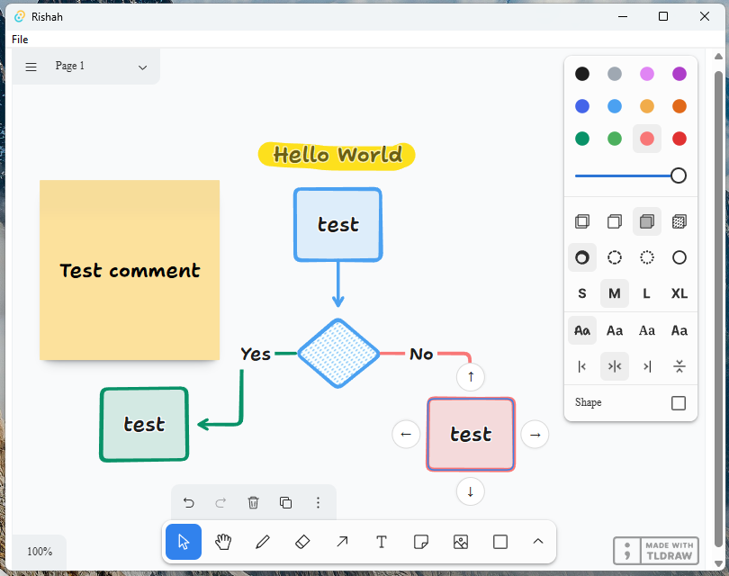

# Rishah

A powerful desktop drawing and whiteboarding application built with Tauri and tldraw. This cross-platform app brings the intuitive tldraw sketching experience to your desktop with native performance and offline capabilities.

## Download and Installation
[Releases](https://github.com/devjaw/Rishah/releases) page

## Features

* **Intuitive Drawing Interface**: Leverage the full power of tldraw's intuitive drawing tools
* **Offline Access**: Create and edit drawings without an internet connection
* **Native Performance**: Enjoy smooth, responsive drawing with native desktop performance
* **Cross-Platform**: Available for Windows, macOS, and Linux
* **File Management**: Save, export, and manage your drawing files locally
* **Custom Shapes and Tools**: Access the complete tldraw toolkit with additional desktop-specific features
* **Keyboard Shortcuts**: Boost your productivity with custom keyboard shortcuts

### Contributing

Contributions are welcome! Please feel free to submit a Pull Request.

## License

This project is licensed under the Apache 2.0 License - see the LICENSE file for details.

## Acknowledgments

* [tldraw](https://tldraw.com/) - The amazing drawing library that powers this application
* [Tauri](https://tauri.app/) - For making it possible to build lightweight, secure desktop applications